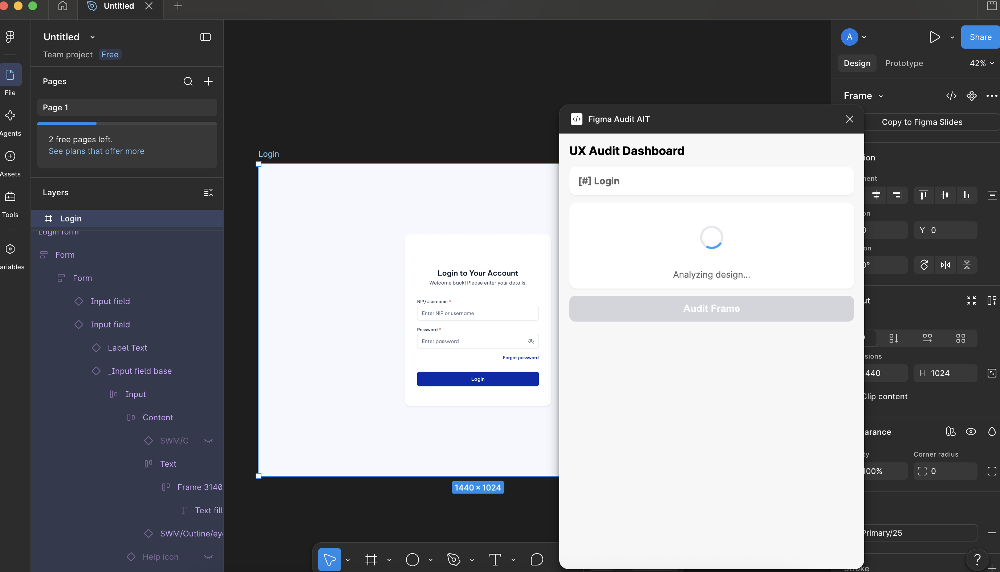
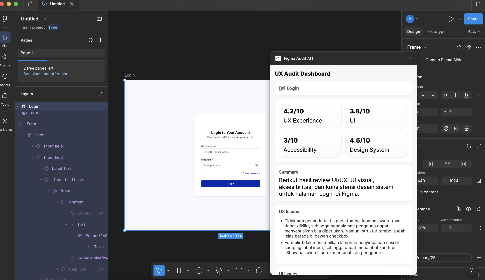
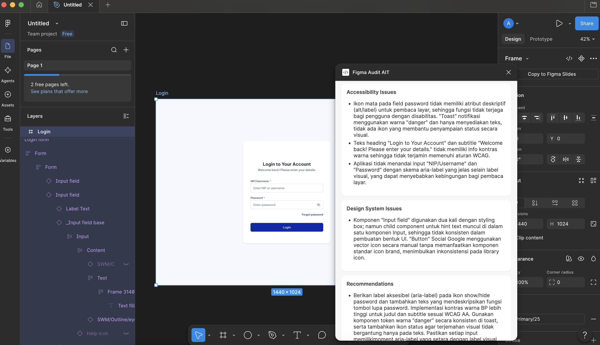

# AI UX Audit – Figma Plugin

AI-powered Figma Plugin that helps designers and developers perform automated UI/UX reviews using Large Language Models (LLMs).

## Features

- Analyze selected Figma frames
- Export design screenshots
- Extract layer metadata
- AI-powered UI/UX review
- Layout & spacing analysis
- Typography consistency review
- Accessibility recommendations
- Visual hierarchy analysis

---

## Project Structure

```
figma-tools/
├── backend/          # Express API & AI integration
├── figma-plugin/     # Figma Plugin source
└── README.md
```

---

## Tech Stack

### Frontend (Plugin)

- TypeScript
- HTML
- CSS
- Figma Plugin API

### Backend

- Node.js
- Express.js
- OpenRouter API
- LLM

---

## Workflow

1. User selects a frame in Figma.
2. Plugin exports the frame as an image.
3. Plugin extracts layer metadata.
4. Backend sends the data to the AI model.
5. AI analyzes the design.
6. Review results are returned to the plugin.

---

## Screenshots

### 1. Loading Analysis



Plugin sedang melakukan analisis desain menggunakan AI.

### 2. Review Result



Ringkasan hasil analisis UI/UX beserta skor evaluasi.

### 3. Detailed Recommendations



Daftar rekomendasi perbaikan yang dihasilkan AI berdasarkan analisis desain.

---

## Future Improvements

- Design System validation
- WCAG accessibility checks
- Design Token validation
- Multi-frame comparison
- Design quality scoring

---

## License

MIT